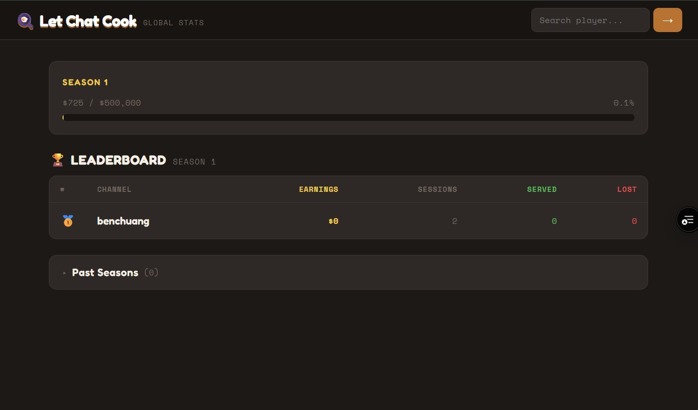
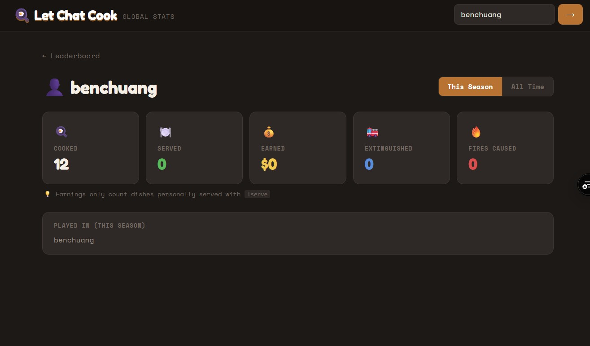

# 🍳 Let Chat Cook — Global Stats

Public leaderboard and player profiles for **[Let Chat Cook](https://github.com/Thianzeren/ChatsKitchen)** — a Twitch chat cooking game where viewers collectively manage a restaurant kitchen.

## Screenshots

### Leaderboard


### Player Profile


## What is this?

After each game session in Let Chat Cook, player stats are automatically submitted to a global leaderboard (Twitch-connected games only). This site shows:

- **Season Leaderboard** — channels ranked by total player earnings this season, with a progress bar toward the season goal ($500,000)
- **Player Profiles** — individual chatter stats (cooked, served, earned, fires caused/extinguished) searchable by Twitch username

> Earnings only count dishes personally served with `!serve` — bot contributions are excluded.

## Seasons

Seasons end automatically when the global earnings goal is reached. A new season starts immediately. Past seasons are visible on the leaderboard page.

## Tech stack

- Vite + React + TypeScript
- [@supabase/supabase-js](https://github.com/supabase/supabase-js) — read-only anon queries
- Deployed on Vercel

## Related

- **Game repo:** [Thianzeren/ChatsKitchen](https://github.com/Thianzeren/ChatsKitchen)
- **Stats site:** [stats.letchatcook.com](https://stats.letchatcook.com) *(coming soon)*

## Local development

```bash
npm install
cp .env.local.example .env.local   # fill in VITE_SUPABASE_URL and VITE_SUPABASE_ANON_KEY
npm run dev
```
